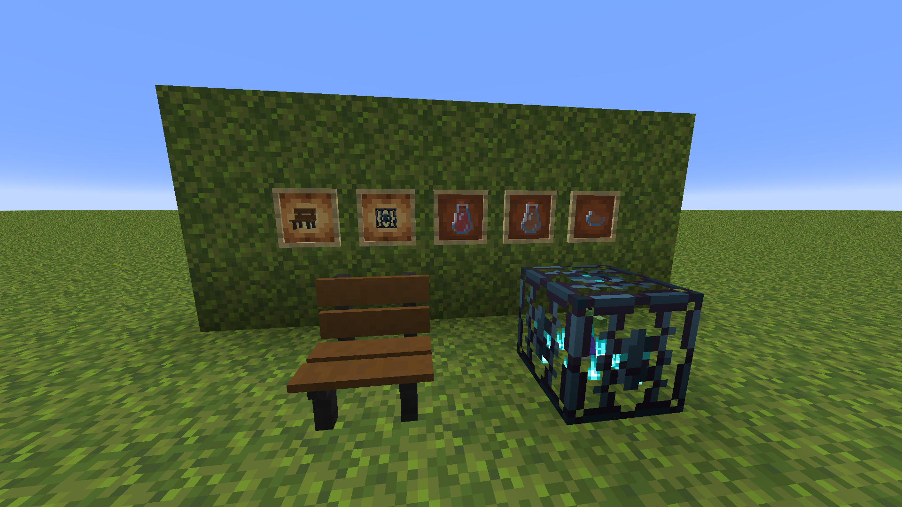
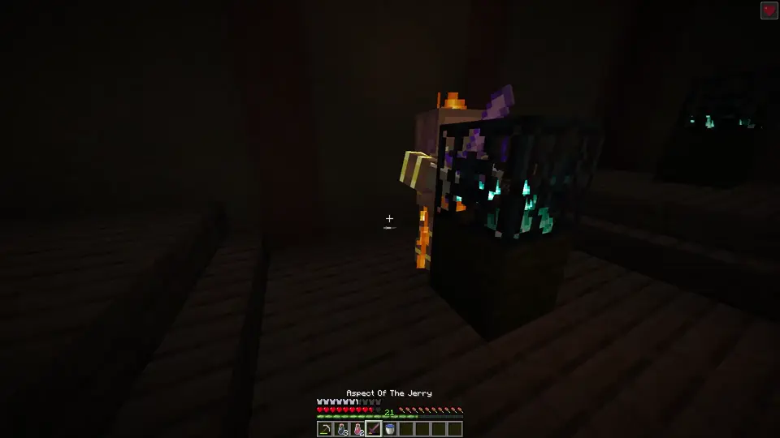
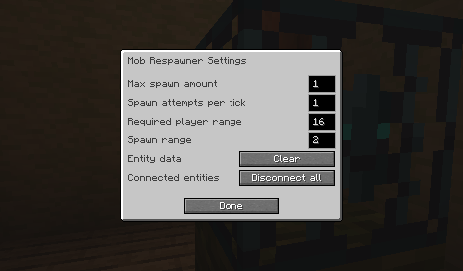

## Souls-like mechanics in Minecraft!

This mod adds some mechanics from souls-like games in the form of a bench, flask and a new type of spawner, namely the Mob Respawner.

You can rest and refill your flasks at a bench. But be careful, as resting will allow all respawners to spawn mobs again!

The respawner can be adjusted to work however you see fit!

## Made for Custom Maps

This mod is designed for use in creating custom maps rather than fitting itself into classic survival gameplay. For this reason, none of the items are obtainable in survival by default.

## Other

This is my first mod and there is still a lot I want to do with this mod. Porting to different versions or mod loaders is not planned for the time being.

Feel free to include this in your map/modpack.
