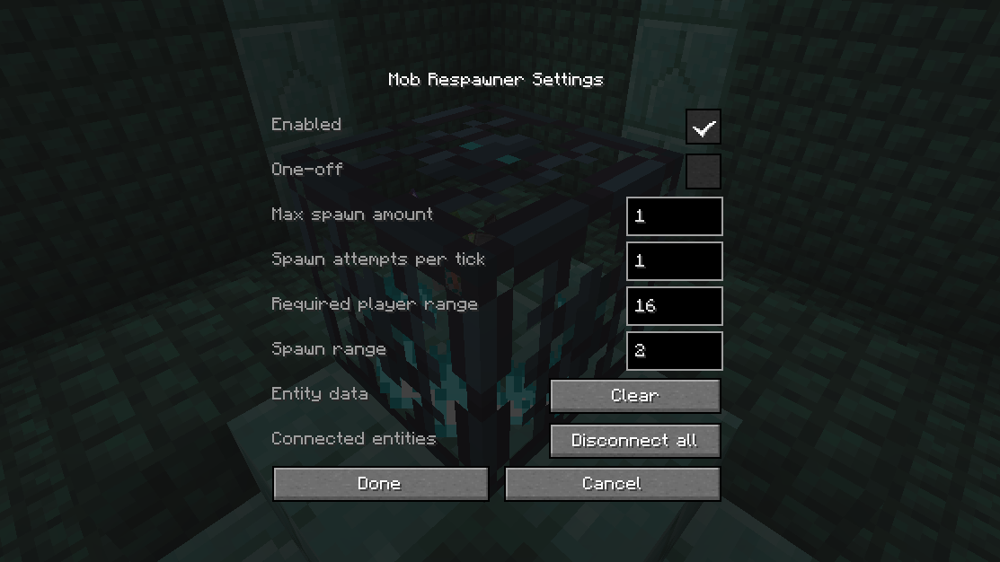

## Souls-like mechanics in Minecraft!

This mod introduces rest points and respawnable enemies in the form of a bench, flask and a new type of spawner, namely the "Mob Respawner".

You can rest and refill your flasks at a bench. But be careful, as this will allow all respawners to spawn mobs again!

The respawner can be adjusted to work however you see fit! More options are coming in the future.

## Features

### Flask

Flasks are health potions which can be refilled by using a bench (or dying). Can be crafted using 3 flask shards.

### Bench

Benches are rest points for the player. Using one will set your spawn point, refill your flasks, clear potion effects, heal you to full health and allow respawners to spawn mobs again.
Also comes with a trapped variant which will emit a short redstone pulse (2 ticks) when used or when a player spawns by it.

### Respawner

Works similar to the vanilla spawner, except this one can only spawn mobs when a bench is used. The respawner keeps track of mobs it spawns and will stop spawning when it reaches its limit.
You can right click this block in creative mode to access a bunch of settings (see image 3).

## Known issues

* Mobs spawned by the respawner are persistent (same as giving items or nametags to mobs). While this fixes most chunk-loading related bugs, it does not fix all of them.
* Despite having "Ignore spawn rules" enabled in config, some mobs still require light levels lower than 12-13 to actually spawn in.

## Made for Custom Maps

This mod is designed for use in creating custom maps rather than fitting itself into classic survival gameplay. For this reason, none of the items are obtainable in survival by default.

If you want souls-like content made for survival, check out the [Bonfires](https://modrinth.com/mod/bonfires) mod!

## Other

This is my first mod and there is still a lot I want to do with this mod. Porting to different versions or mod loaders is not planned for the time being.

Feel free to include this in your map/modpack.
